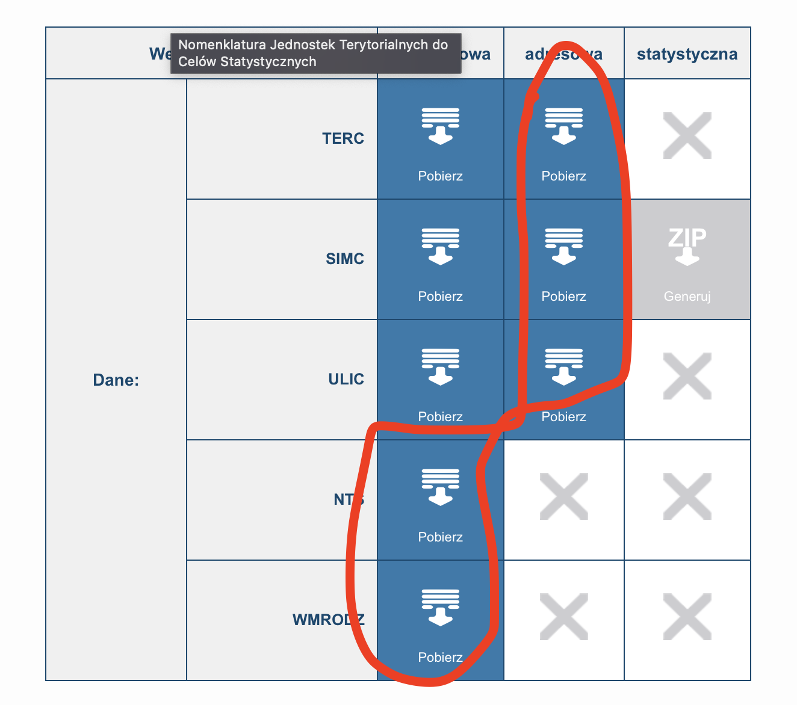

# Data generator

## TERYT
Make a folder (e.g. named `teryt`) somewhere outside the repo. Download to it the following ZIPs
from https://eteryt.stat.gov.pl/eTeryt/rejestr_teryt/udostepnianie_danych/baza_teryt/uzytkownicy_indywidualni/pobieranie/pliki_pelne.aspx?contrast=default

You don't need to extract the ZIPs. Pass the path to the folder you made to `--teryt-path`.